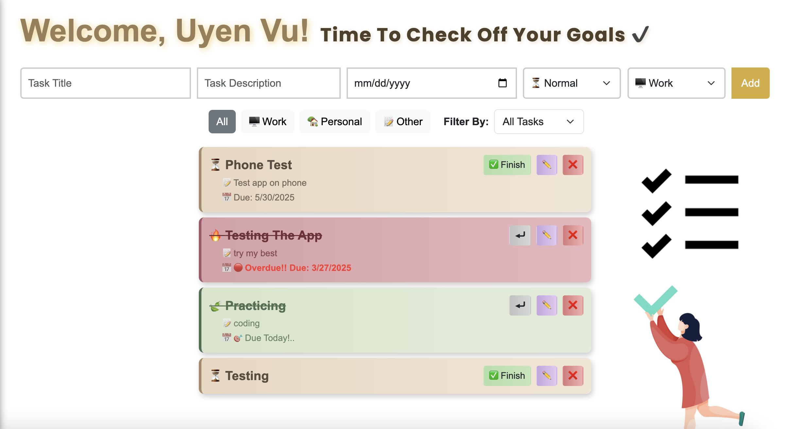
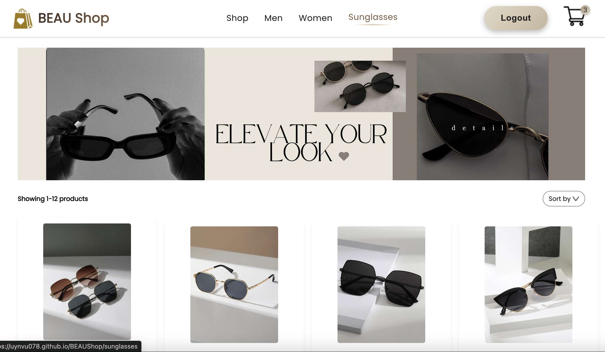
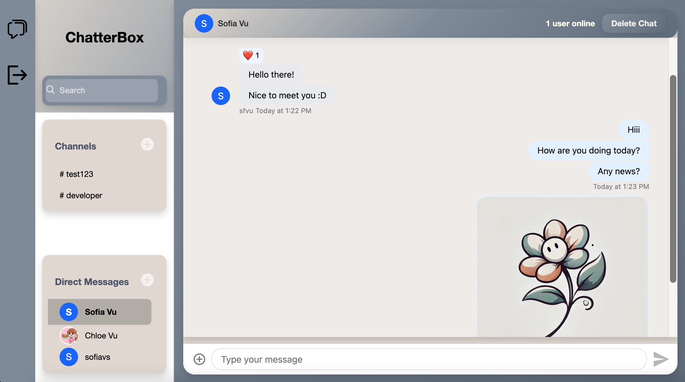
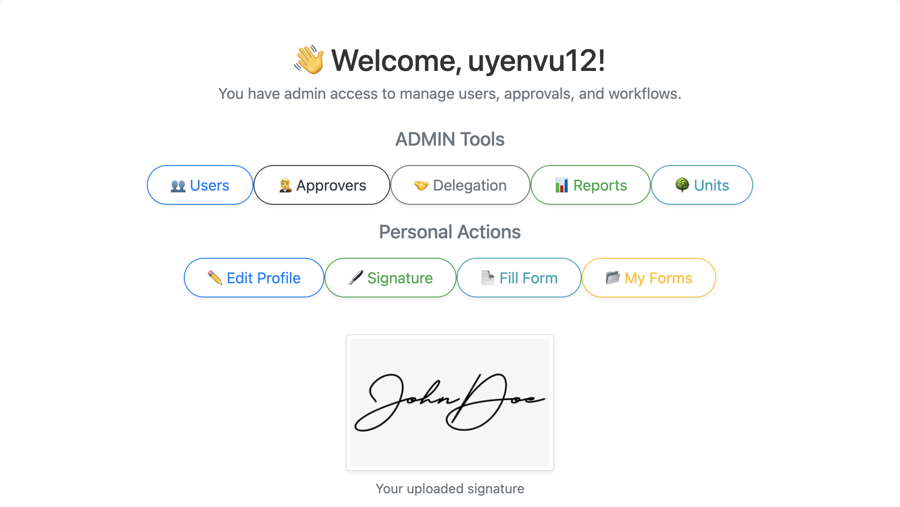

---

  
  <!-- Greeting Line -->
  

    👩‍💻 Hello, I'm Uyen Vu
  

  <!-- Flex container: Image + Description -->
  

    
    <!-- Image -->
    

    <!-- Description -->
    

      

        I'm a <strong>Software Developer</strong> passionate about building clean, scalable, and user-friendly web applications.  
        I specialize in <strong>JavaScript, React, Node.js, and Django</strong>, and love turning ideas into elegant digital solutions.
      

      

        <a href="https://www.linkedin.com/in/uyen-vu-sf8358/" target="_blank" rel="noopener noreferrer">💼 LinkedIn</a> &nbsp;•&nbsp;
        <a href="https://github.com/uynvu078" target="_blank" rel="noopener noreferrer">💻 GitHub</a> &nbsp;•&nbsp;
        <a href="mailto:uyenvu315@gmail.com">📧 Email Me</a>
      

    

  

---

<section style="max-width: 600px; margin: 0 auto; text-align: center;">
  <h2 style="font-size: 2.2rem; margin-bottom: 0.5rem;">🏫 Education</h2>
  

  

    <strong>University of Houston</strong> 
    <em>Bachelor of Science in Computer Science</em> — Class of 2025 
    <em>Minor in Business Administration</em>
  

</section>

---

<section style="max-width: 700px; margin: 0.5rem auto; text-align: center;">
  <h2 style="font-size: 2.2rem; margin-bottom: 0.3rem;">🌐 Portfolio & Resume</h2>
  

  

    Explore my project showcase and download a copy of my latest resume.  
    Perfect for recruiters, collaborators, and curious devs!
  

  

    <a href="https://uynvu078.github.io/Portfolio-UyenVu/" target="_blank" rel="noopener noreferrer" class="custom-button">
      💻 Visit My Portfolio
    </a>
    <a href="https://uynvu078.github.io/Resume.pdf" target="_blank" rel="noopener noreferrer" class="custom-button">
      📄 View My Resume (PDF)
    </a>
  

</section>

---

<section style="max-width: 700px; margin: 2rem auto; text-align: center;">
  <h2 style="font-size: 2.2rem; margin-bottom: 0.3rem;">📈 Featured Projects</h2>
  

</section>

<!-- Project 1 Zentasker -->
<section class="project-card">
  
  

    <h3 style="margin-top: 0; text-align: left; font-size: 1.5rem;">ZenTasker – Task Management App</h3>
    
A full-stack productivity tool with JWT authentication, category-based task filtering, priority tags, and drag-and-drop functionality.

    
<strong>Tech:</strong> React, Node.js, Express, MongoDB

    

      <a href="https://github.com/uynvu078/ZenTasker-Todo" target="_blank" rel="noopener noreferrer">🔗 GitHub Repo</a> • 
      <a href="https://uynvu078.github.io/ZenTasker-Todo/" target="_blank" rel="noopener noreferrer">🔗 Live Demo</a>
    

  

</section>

<!-- Project 2 BEAUShop -->
<section class="project-card">
  
  

    <h3 style="margin-top: 0; text-align: left; font-size: 1.5rem;">BEAU Shop – E-Commerce Website</h3>
    
An elegant online storefront with product sorting, cart system, checkout flow, and integrated Stripe payments.

    
<strong>Tech:</strong> React, Express, MongoDB, Stripe API

    

      <a href="https://github.com/uynvu078/BEAUShop" target="_blank" rel="noopener noreferrer">🔗 GitHub Repo</a> • 
      <a href="https://uynvu078.github.io/BEAUShop/" target="_blank" rel="noopener noreferrer">🔗 Live Demo</a>
    

  

</section>

<!-- Project 3 ChatApp -->
<section class="project-card">
  
  

    <h3 style="margin-top: 0; text-align: left; font-size: 1.5rem;">ChatterBox – Real-Time Chat App</h3>
    
A feature-rich messaging platform using Stream Chat API with group channels, custom theming, and Microsoft OAuth login.

    
<strong>Tech:</strong> React, Stream Chat, Node.js, Express

    

      <a href="https://github.com/uynvu078/ChatterBox" target="_blank" rel="noopener noreferrer">🔗 GitHub Repo</a> • 
      <a href="https://uynvu078.github.io/ChatterBox/" target="_blank" rel="noopener noreferrer">🔗 Live Demo</a>
    

  

</section>

---

<section style="max-width: 700px; margin: 1rem auto 1.5rem auto; text-align: center;">
  <h2 style="font-size: 2.2rem; margin-bottom: 0.3rem;">🎓 School Project</h2>
  

</section>

<section class="project-card">
  
  

    <h3 style="margin-top: 0; text-align: left; font-size: 1.5rem;">Cambridge Approval System – University Team Project</h3>
    
An internal request approval system for academic forms, including delegated approvals, form versioning, dynamic routing, and authentication with Microsoft OAuth.

    
<strong>Tech:</strong> Django, PostgreSQL, Docker, LaTeX

    

      <a href="https://github.com/uynvu078/Cambridge_teamProject" target="_blank" rel="noopener noreferrer">🔗 GitHub Repository</a> • 
      <a href="https://youtu.be/Y1gwqXkWhXM?si=SJFdUItgNU_WTDRj" target="_blank" rel="noopener noreferrer">🎥 Watch Demo</a>
    

  

</section>

---

<footer style="width: 100%; padding: 3rem 1rem 2rem; background: none; text-align: center;">
  

    <a href="https://github.com/uynvu078" target="_blank" rel="noopener noreferrer" style="color: #444; font-size: 1.6rem; text-decoration: none;">
      <i class="fab fa-github"></i>
    </a>
    <a href="https://www.linkedin.com/in/uyen-vu-sf8358/" target="_blank" rel="noopener noreferrer" style="color: #444; font-size: 1.6rem; text-decoration: none;">
      <i class="fab fa-linkedin"></i>
    </a>
  

  

    © 2025 Uyen Vu. All rights reserved.
  

</footer>

